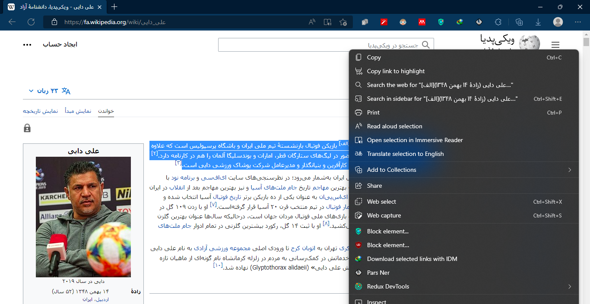
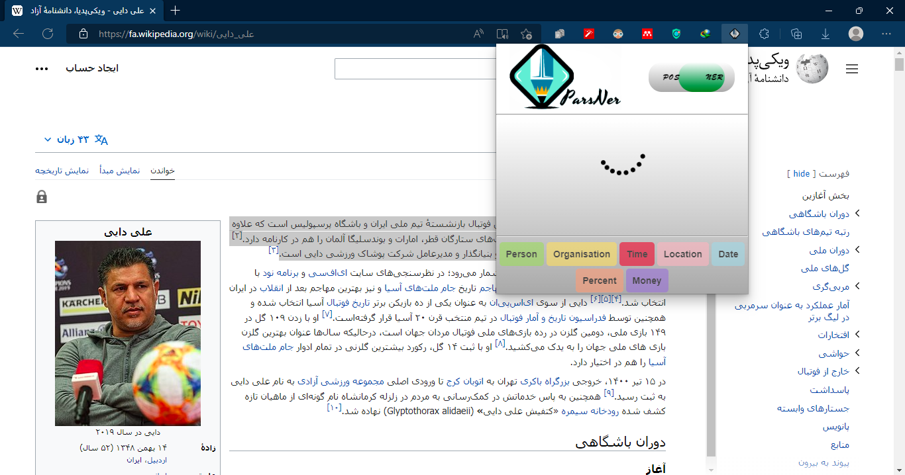
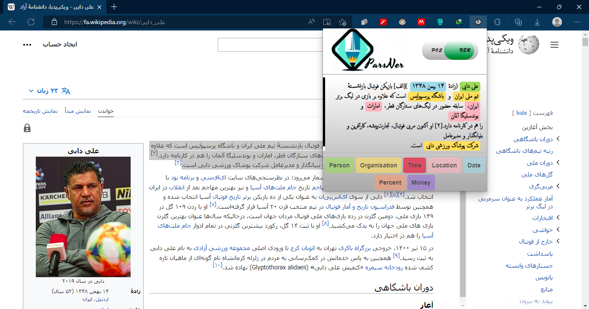

# bachelor-project

<h2> ParsNer plugin</h2>

persian named entity recognition and part of speech tagging plugin

<h3> How to install</h3>

check [readme](https://github.com/hamedkhaledi/bachelor-project/tree/master/src/plugin/readme.md)

<h3> How to use</h3>

* select a persian text on browser and click on parsNer button:
  
* wait for result :
  
* and done :smiley: :
  